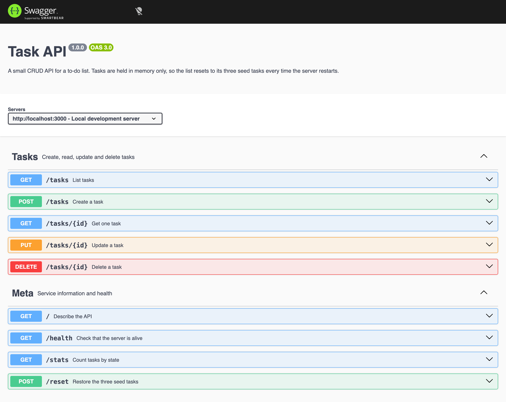
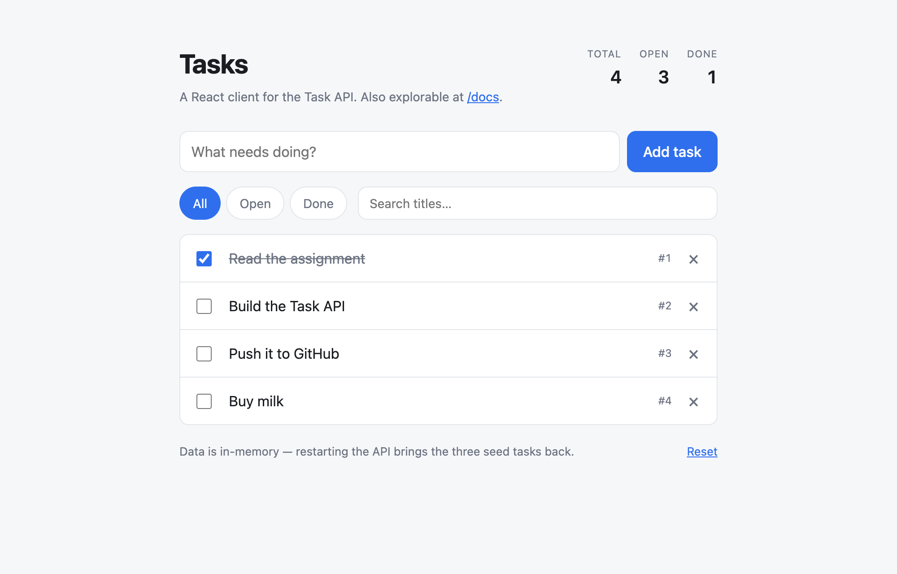
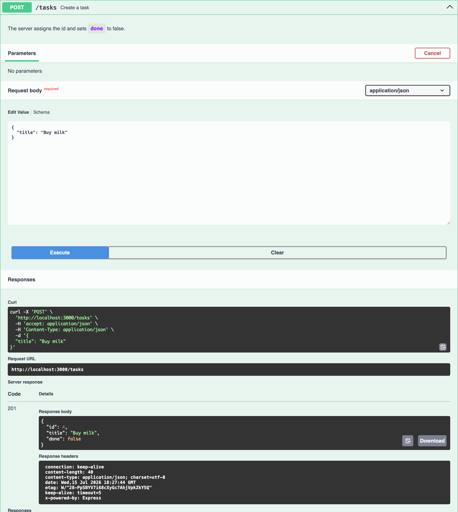

# Task API

A small CRUD API that manages a to-do list — create, read, update and delete tasks — with interactive
Swagger UI documentation at `/docs`.

Built for **FlyRank Internship · Backend Track** — the API and Swagger UI in Week 2 (A1), and its
storage moved onto a real database in Week 3 (A2). JavaScript lane: Node.js + Express + SQLite.

Tasks live in a SQLite file called `tasks.db`. **They survive a restart** — which is the entire
point of Week 3, and the one thing the Week 2 version could not do.



## Requirements

- [Node.js](https://nodejs.org) 18 or newer (`node -v` to check)

No database to install. SQLite has no server and no setup: it is a single file, and the file is
created for you the first time the app runs.

## Install & run

```bash
npm install
npm start
```

That is the whole thing. The server starts on **<http://localhost:3000>**, creates `tasks.db` if it
is missing, creates the `tasks` table if it is missing, and seeds three example tasks if the table is
empty. A fresh clone goes from `git clone` to a working, populated API in two commands.

Open **<http://localhost:3000/docs>** for Swagger UI, where every endpoint below can be run with the
**Try it out** button — no curl required.

To run with auto-reload while editing: `npm run dev`.
To use a different port: `PORT=4000 npm start`.
To run the tests: `npm test`.

## The React client (optional extra)

The assignment only asks for the API and Swagger UI. This repo also includes a small React app that uses
the same endpoints, so the CRUD cycle can be driven from a real UI instead of a docs page.



Task **#4** above is the one created by the Swagger screenshot further down — same server, same rows
in `tasks.db`, viewed through a different client.

With the API already running in one terminal, in a second terminal:

```bash
npm install --prefix frontend
npm run dev --prefix frontend
```

Then open **<http://localhost:5173>**. It lists tasks, adds them, renames them inline, ticks them off,
deletes them, filters by state, searches, and shows the live counts from `/stats`.

The API sends no CORS headers and does not need to: the Vite dev server proxies `/tasks`, `/stats`,
`/reset` and `/health` to port 3000, so the browser only ever talks to one origin.

## The database

### Why SQLite

- **It is one file.** `tasks.db` is the whole database. Nothing to install, no server process to
  start, no port, no username and password, no connection string to keep out of Git.
- **It survives restarts.** The only property Week 2's in-memory list was missing, and the reason
  this assignment exists.
- **It is real SQL.** `SELECT`, `INSERT`, `UPDATE`, `DELETE`, `WHERE`, `ORDER BY`, indexes,
  transactions — the same language and the same ideas as Postgres, at a size you can read in an
  afternoon. Nothing learned here is thrown away when a project outgrows it.
- **A stranger can run it.** No setup step means no setup step to get wrong.

What it is *not* good at is many machines writing at once — that is the point where a project moves
to Postgres or MySQL. For one server and one to-do list, that trade is free.

The library is [`better-sqlite3`](https://github.com/WiseLibs/better-sqlite3), whose queries are
synchronous: no `await`, no callbacks, and `db.js` reads top to bottom.

### Where the database file lives

`tasks.db`, in the project root, next to `server.js`. It is **git-ignored on purpose** — it is
generated, not source. Committing it would ship one particular person's to-do list to everyone who
clones the repo, and every clone would start from someone else's data instead of the three examples.

Deleting it is safe and is the fastest way to start over:

```bash
rm tasks.db && npm start   # back to the three seeded tasks
```

`POST /reset` does the same thing without stopping the server.

### The schema

```sql
CREATE TABLE tasks (
  id         INTEGER PRIMARY KEY AUTOINCREMENT,
  title      TEXT    NOT NULL,
  done       INTEGER NOT NULL DEFAULT 0 CHECK (done IN (0, 1)),
  created_at TEXT    NOT NULL DEFAULT (strftime('%Y-%m-%dT%H:%M:%SZ', 'now')),
  updated_at TEXT    NOT NULL DEFAULT (strftime('%Y-%m-%dT%H:%M:%SZ', 'now'))
);

CREATE INDEX idx_tasks_done  ON tasks(done);
CREATE INDEX idx_tasks_title ON tasks(title COLLATE NOCASE, id);
```

SQLite has no boolean type, so `done` is stored as `0`/`1` and translated to `true`/`false` on its
way out — [`db.js`](db.js) is the only file that knows about that.

**What the indexes are for.** An index is a sorted copy of one or more columns that the database
keeps beside the table, so it can jump straight to matching rows instead of reading every row to find
them — the difference between using a book's index and reading the book.

Both of these were checked with `EXPLAIN QUERY PLAN`, which is the only way to know an index is
actually being used rather than merely existing:

```console
$ sqlite3 tasks.db "EXPLAIN QUERY PLAN SELECT * FROM tasks WHERE done = 1;"
SEARCH tasks USING INDEX idx_tasks_done (done=?)
```

That check was worth running. The title index was first written as `ON tasks(title)` while the sort
is `ORDER BY title COLLATE NOCASE, id` — and an index sorted one way cannot answer a query that wants
another, so the planner silently ignored it and said `SCAN`. Matching the index to the collation and
the tiebreaker the query actually uses is what turned it into `SCAN tasks USING INDEX idx_tasks_title`.
Neither index helps `?search=`: `LIKE '%milk%'` starts with a wildcard, and an index is only useful
when you know how a value begins.

**What the transactions are for.** Seeding is three `INSERT`s guarded by a "is the table empty?"
count, and it runs inside a transaction so those three inserts are one all-or-nothing step. Without
it, a crash after the first insert would leave a table holding one seed — no longer empty, so the
count would never trigger again, and the database would be permanently stuck one-third seeded.
`POST /reset` is wrapped for the same reason: it deletes every row and re-inserts the seeds, and a
failure in between would otherwise leave you with no tasks at all.

### Seeing it with your own eyes

`tasks.db` opens in [DB Browser for SQLite](https://sqlitebrowser.org) — free, and worth having.
Here is the same data the API serves, laid out as a table:


One query from [the Stage 4 session](docs/stage4-sql.md), run by hand in DB Browser's **Execute SQL**
tab while the server was still running:

```sql
SELECT * FROM tasks WHERE done = 1;
```

It returned a single row — task 1, *"Read the assignment"* — because it is the only seeded task with
`done = 1`. That is the same filter `GET /tasks?done=true` performs, which is not a coincidence: the
endpoint runs that query.

The [full Stage 4 transcript](docs/stage4-sql.md) has the other four queries and what each returned,
including the moment that makes the whole assignment click — running `UPDATE tasks SET done = 1;` by
hand and watching `GET /tasks` report every task as done, with no restart and no syncing step. DB
Browser and the API are not two copies of the data. They are two windows onto one file.

## Endpoints

| Method | Path | What it does | Success | Errors |
| --- | --- | --- | --- | --- |
| `GET` | `/` | Describes the API | `200` | — |
| `GET` | `/health` | Liveness check — returns `{"status":"ok"}` | `200` | — |
| `GET` | `/tasks` | Lists all tasks. Supports `?done=`, `?search=`, `?sort=`, `?limit=`, `?offset=` | `200` | `400` invalid query |
| `GET` | `/tasks/:id` | Returns one task | `200` | `404` unknown id |
| `POST` | `/tasks` | Creates a task from `{"title":"..."}` | `201` | `400` missing/empty title |
| `PUT` | `/tasks/:id` | Updates `title` and/or `done` | `200` | `400` empty/invalid body · `404` unknown id |
| `DELETE` | `/tasks/:id` | Removes a task, empty body | `204` | `404` unknown id |
| `GET` | `/stats` | Counts tasks by state | `200` | — |
| `POST` | `/reset` | Restores the three seed tasks | `200` | — |
| `GET` | `/docs` | Swagger UI | `200` | — |
| `GET` | `/openapi.json` | The raw OpenAPI 3.0 spec | `200` | — |

Every error response is JSON in the shape `{ "error": "..." }`.

### The task shape

```json
{
  "id": 1,
  "title": "Read the assignment",
  "done": true,
  "created_at": "2026-07-31T18:23:49Z",
  "updated_at": "2026-07-31T18:23:50Z"
}
```

`id`, `title` and `done` are unchanged from Week 2. The two timestamps are new, and the database sets
both of them — `created_at` once, `updated_at` on every write.

## Example requests

A successful create, and a 404 — real output, headers included:

```console
$ curl -i -X POST http://localhost:3000/tasks \
    -H "Content-Type: application/json" \
    -d '{"title":"Buy milk"}'
HTTP/1.1 201 Created
X-Powered-By: Express
Content-Type: application/json; charset=utf-8
Content-Length: 112
ETag: ...
Date: ...
Connection: keep-alive
Keep-Alive: timeout=5

{"id":4,"title":"Buy milk","done":false,"created_at":"2026-07-31T18:50:11Z","updated_at":"2026-07-31T18:50:11Z"}

$ curl -i http://localhost:3000/tasks/99
HTTP/1.1 404 Not Found
X-Powered-By: Express
Content-Type: application/json; charset=utf-8
Content-Length: 29
ETag: ...
Date: ...
Connection: keep-alive
Keep-Alive: timeout=5

{"error":"Task 99 not found"}
```

The full CRUD cycle:

```bash
curl -i -X POST http://localhost:3000/tasks -H "Content-Type: application/json" -d '{"title":"Buy milk"}'   # 201
curl -i http://localhost:3000/tasks                                                                        # 200
curl -i -X PUT http://localhost:3000/tasks/4 -H "Content-Type: application/json" -d '{"done":true}'        # 200
curl -i -X DELETE http://localhost:3000/tasks/4                                                            # 204
curl -i http://localhost:3000/tasks/4                                                                      # 404
```

Filtering, search, sorting and pagination — every one of them a clause in the SQL, not a loop in
JavaScript:

```bash
curl "http://localhost:3000/tasks?done=true"        # WHERE done = ?
curl "http://localhost:3000/tasks?search=milk"      # WHERE title LIKE ? (case-insensitive)
curl "http://localhost:3000/tasks?sort=title"       # ORDER BY title COLLATE NOCASE
curl "http://localhost:3000/tasks?limit=2&offset=2" # LIMIT ? OFFSET ?
curl "http://localhost:3000/stats"                  # SELECT COUNT(*), SUM(done)
```

Real APIs never return "everything" from a list endpoint: the list only grows, so an unbounded `GET /tasks`
sends a response whose size and cost nobody controls — slow for the client, expensive for the server, and
liable to fall over exactly when the app becomes popular. `limit`/`offset` make the cost of a request
predictable regardless of how much data exists.

Moving these into SQL changed the cost as well as the code. The old version fetched every row and then
threw most of them away in JavaScript; `LIMIT 2` asks the database for two rows and gets two rows. At
three tasks that difference is invisible. At three million it is the difference between an API and an
outage.

## Swagger UI

`/docs` is not just a list — every endpoint has a **Try it out** button that sends a real request. Here is
`POST /tasks` being executed from the page itself, with the server's live `201` and the created task coming
back:



The whole CRUD cycle — create, list, update, delete — works this way without touching curl.

## The mortality experiment, repeated

Week 2's README ended with an experiment: create a few tasks, stop the server, start it again, and
watch them be gone. The list only ever existed in the process's memory, so quitting the process threw
it away.

Run the same experiment now:

```bash
curl -X POST http://localhost:3000/tasks -H "Content-Type: application/json" -d '{"title":"Survive the restart"}'
# stop the server with Ctrl-C, then start it again
npm start
curl http://localhost:3000/tasks   # "Survive the restart" is still there
```

Nothing about the API changed. The task is still there because it was never in the API — it was
written to `tasks.db`, and a file does not care that the program that wrote it has stopped running.

`npm test` runs that experiment automatically: `test/persistence.test.js` kills the server and starts
a new one between assertions.

## Why the tests didn't change

`test/api.test.js` describes the API as Week 2 left it — the endpoints, the request and response
shapes, the status codes. It does not contain the words SQLite, table, row or query. It talks to the
server over HTTP, exactly like any other client.

That file passes against **both** versions. Checking A1's `server.js` out of Git into a scratch
directory and running this exact test file against the in-memory implementation gives 12 passing
tests; running it against the SQLite implementation gives the same 12.

That is the proof the assignment is really about. A test that passes against two completely different
storage layers is a test that was never testing the storage layer — it was testing the promise the API
makes to its clients. Storage is an implementation detail precisely because you can swap it and the
tests cannot tell.

The reverse holds too, and is just as informative. `test/persistence.test.js` — the suite that
restarts the server mid-test — fails 5 of its 7 tests against the in-memory version. (The other two
pass by accident: the in-memory list also has three tasks after a restart, though because it was
rebuilt rather than remembered, and JavaScript's `includes` never treated `%` as a wildcard in the
first place.) Those five failures are the exact value the database added, written down as
assertions.

## Project layout

```
server.js        the API — routes, validation, status codes. Knows no SQL.
db.js            the storage layer — schema, seeding, and every query
openapi.json     the OpenAPI 3.0 spec that Swagger UI renders at /docs
tasks.db         the database (generated on first run, git-ignored)
test/
  api.test.js         the A1 contract — passes against both implementations
  persistence.test.js what the database bought: survives restarts, seeds once
docs/
  stage4-sql.md  the by-hand SQL session and what each query returned
frontend/
  vite.config.js dev-server proxy to the API on port 3000
  src/api.js     fetch wrapper — unwraps the { error } bodies
  src/App.jsx    the task list, filters and stats
  src/TaskRow.jsx one row: toggle, inline rename, delete
```

The split is the shape of the assignment: `server.js` decides *what the API promises*, `db.js`
decides *where the data is kept*. Moving from a list to a database touched the second file and left
the first one's routes doing the same job in the same order.

## Notes on design

A few decisions worth calling out:

- **`PUT` accepts partial bodies.** Sending `{"done":true}` leaves `title` alone. Strict REST would call this
  `PATCH`, but the assignment specifies `PUT` for "title and/or done", so that is what it does. The statement
  still writes both columns — whatever the body left out is filled in from the row as it stands.
- **Ids are never reused.** The column is `INTEGER PRIMARY KEY AUTOINCREMENT`. Without `AUTOINCREMENT`,
  SQLite reuses the id of the highest deleted row, so deleting the newest task would hand its id to the next
  one created — the same promise Week 2 made, kept by the database instead of by a `Math.max` in the app.
- **Every value goes in as a `?` parameter.** No user input is ever concatenated into SQL. Where a query
  varies in *shape* rather than in values — `?sort=title` — the column name is looked up in a fixed table of
  allowed columns and an unknown one is a `400`, because a placeholder cannot stand in for a column name.
- **`%` and `_` in a search are text, not wildcards.** They are escaped before reaching `LIKE`, so
  `?search=50%` finds titles containing "50%" instead of matching everything.
- **`/tasks/abc` is a 404, not a 500.** In the in-memory version a `NaN` id simply matched nothing. Handed to
  a SQL parameter it is a different kind of nothing, so ids are validated before they reach a query.
- **Unparseable JSON returns a JSON error.** Express's default handler answers with an HTML error page, which
  would break the "every error is JSON" rule, so there is an explicit handler for it.
- **Whitespace-only titles are rejected.** `{"title":"   "}` is a `400`, not a task named `"   "`.
- **The React client does not re-validate.** Submitting an empty title sends the request anyway and shows the
  server's `400` message, because the server is the thing that owns that rule.

### Adding the timestamps was a migration, and it felt like one

`created_at` and `updated_at` were an afterthought, and adding them was the only part of this
assignment that was genuinely awkward. `CREATE TABLE IF NOT EXISTS` does nothing at all to a table
that already exists, so putting the new columns in the schema gave them to fresh databases and left
every existing `tasks.db` on the old shape — including mine. Making it work everywhere meant asking
SQLite what columns the table actually has (`PRAGMA table_info`) and running `ALTER TABLE ADD COLUMN`
for whichever were missing, and then discovering that SQLite refuses a non-constant default on
`ALTER TABLE`, so the columns arrive empty and need a second statement to backfill them.

The feeling is the point. Changing code is free — you replace the old text with the new text.
Changing a table's shape is not, because the old shape is still out there holding real data you are
not allowed to lose, and the change has to be written as instructions for getting from one to the
other. That set of instructions is a migration, and this one is about fifteen lines at the top of
[`db.js`](db.js) doing by hand what a migration tool would generate.
